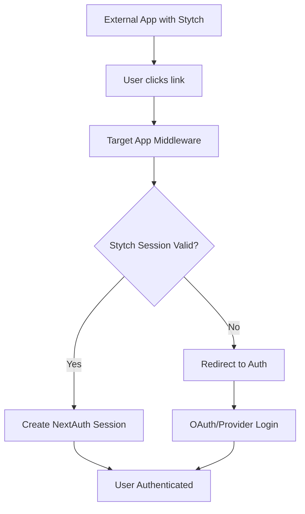

# Authentication Architecture

## Overview

Our authentication system implements a cross-application session sharing strategy that allows seamless user transitions between multiple applications while maintaining security and user experience standards.

## Authentication Strategy

### Core Requirements

1. **Cross-Application Session Sharing**: Users authenticated in one application should automatically be authenticated in connected applications
2. **Multiple Provider Support**: The system must support multiple authentication providers for future scalability
3. **Fallback Authentication**: Users without existing sessions should have alternative authentication methods
4. **Session Security**: Shared sessions must maintain security standards across applications

### Architecture Components



## Stytch Integration Architecture

### Primary Authentication Flow

1. **Session Detection**: Middleware intercepts incoming requests to detect existing Stytch session cookies
2. **Session Validation**: Valid Stytch sessions are authenticated against Stytch's API endpoints
3. **NextAuth Integration**: Validated Stytch sessions automatically create corresponding NextAuth sessions
4. **Fallback Strategy**: Users without valid Stytch sessions use standard OAuth providers

### Technical Implementation

#### Middleware Layer
- **Route Interception**: Monitors protected routes for authentication requirements
- **Cookie Analysis**: Extracts and validates Stytch session cookies
- **API Validation**: Verifies session authenticity with Stytch backend
- **Session Creation**: Bridges Stytch validation to NextAuth session management

#### NextAuth Configuration
- **Custom Provider**: Stytch OAuth provider for fallback authentication
- **Session Callbacks**: Custom logic to handle Stytch-validated user data
- **Sign-in Callbacks**: Integration points for external session validation

## Session Flow Architecture

### Successful Cross-App Authentication
```
1. User authenticated in App A (Stytch)
2. User navigates to App B via link
3. App B middleware detects Stytch cookie
4. Middleware validates session with Stytch API
5. Valid session creates NextAuth session in App B
6. User seamlessly authenticated in App B
```

### Fallback Authentication Flow
```
1. User directly accesses App B
2. No valid Stytch session detected
3. User redirected to NextAuth sign-in
4. User selects Stytch OAuth provider
5. Standard OAuth flow completes
6. User authenticated in App B
```

## Security Considerations

### Cookie Security
- **Domain Scope**: Applications must share domain/subdomain for cookie access
- **Secure Flags**: All authentication cookies use secure, httpOnly, and sameSite flags
- **Expiration Management**: Session expiration synchronized between Stytch and NextAuth

### Session Validation
- **API Verification**: All session claims verified against Stytch backend
- **Token Refresh**: Automatic token refresh for long-lived sessions
- **Concurrent Session Management**: Handle multiple active sessions across applications

### Cross-Origin Considerations
- **CORS Configuration**: Proper CORS setup for cross-application requests
- **CSP Headers**: Content Security Policy configured for authentication flows
- **Token Passing**: Secure token exchange for applications on different domains

## Configuration Requirements

### Environment Variables
```bash
# Stytch Configuration
STYTCH_PROJECT_ID=your_project_id
STYTCH_SECRET=your_secret_key
STYTCH_ENVIRONMENT=test|live

# NextAuth Configuration
NEXTAUTH_SECRET=your_nextauth_secret
NEXTAUTH_URL=your_app_url
```

### Domain Configuration
- Applications sharing sessions must be on same domain/subdomain
- Alternative: URL-based token passing for cross-domain scenarios

## Benefits

1. **Seamless User Experience**: No repeated authentication across related applications
2. **Flexible Provider Support**: Easy addition of new authentication providers
3. **Security Maintenance**: Centralized session management with Stytch
4. **Scalability**: Architecture supports multiple applications and providers

## Implementation Considerations

### Development Phase
- Test environment configuration for both Stytch and NextAuth
- Local development with proper domain/cookie setup
- Debugging tools for session flow validation

### Production Deployment
- SSL/TLS requirements for secure cookie transmission
- Load balancer configuration for session affinity
- Monitoring and logging for authentication flows

> **Implementation Guide**: For step-by-step setup instructions, see [How to Set Up Cross-Application Authentication](/guides/admin/setup-authentication)

## Future Enhancements

1. **Additional Providers**: Integration with social providers, SAML, etc.
2. **Session Analytics**: User authentication patterns and security monitoring  
3. **Mobile Integration**: Native app authentication flow integration
4. **Single Sign-Out**: Coordinated logout across all connected applications 